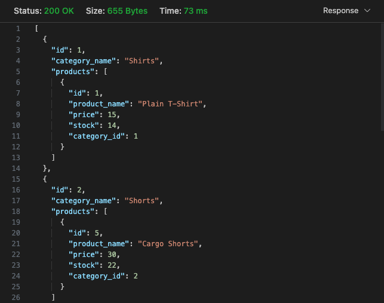

# Fleet Commerce ⛵

## Description

[🏗️ Click here to see installation instructions.](#🏗️-installation)

[🎥 Walkthrough video of Fleet Commerce.](https://drive.google.com/file/d/1d67FsM817OdWUPemlcn3JYrFfeRgp3l7/view?usp=sharing)

Fleet Commerce is a fast and fluid ecommerce API.

The API's database is established through Sequelize, allowing query data to be easily parsed. The database is set up with sample products, categories, and tags, which would all be found on a large ecommerce site.

## 🏗️ Installation

To install, first clone the repository:

    git clone git@github.com:jacob-medina/fleet-commerce.git

Then, in the root directory of the project, install dependencies:

    npm install

## 🛠️ Setup

**This application requires a `.env` in the root directory** to use certain environment variables. You can create it with your specifications by running:

    npm run env

If you do not have a database created and in use, you can do so by running:

    npm run buildDB

## ⛵ Usage

To start a Fleet Commerce server, run:

    npm start

Then, you may use any API platform or client to make requests to the server. You may choose the following options via their routes:

### Categories

| Description | Method | Route |
| --- | --- | --- |
| Get all Categories | GET | `/api/categories` |
| Get Category by ID | GET | `/api/categories/:id` |
| Add New Category | POST | `/api/categories/` |
| Update Category by ID | PUT | `/api/categories/:id` |
| Delete Category by ID | DELETE | `/api/categories/:id` |

### Products

| Description | Method | Route |
| --- | --- | --- |
| Get all Products | GET | `/api/products` |
| Get Product by ID | GET | `/api/products/:id` |
| Add New Product | POST | `/api/products/` |
| Update Product by ID | PUT | `/api/products/:id` |
| Delete Product by ID | DELETE | `/api/products/:id` |

### Tags

| Description | Method | Route |
| --- | --- | --- |
| Get all Tags | GET | `/api/tags` |
| Get Tag by ID | GET | `/api/tags/:id` |
| Add New Tag | POST | `/api/tags/` |
| Update Tag by ID | PUT | `/api/tags/:id` |
| Delete Tag by ID | DELETE | `/api/tags/:id` |

## 📝 Credits

The following npm packages were used in the development of Fleet Commerce:
- [dotenv](https://www.npmjs.com/package/dotenv)
- [express](https://www.npmjs.com/package/express)
- [inquirer](https://www.npmjs.com/package/inquirer/v/8.2.4)
- [mysql2](https://www.npmjs.com/package/mysql2)
- [sequelize](https://www.npmjs.com/package/sequelize)
- [nodemon](https://www.npmjs.com/package/nodemon)

Backend starter code by: [edX Boot Camps LLC](https://github.com/coding-boot-camp/fantastic-umbrella)

## ⚖️ License
This project is made under the [MIT License](./LICENSE).